# MTG_Reanimator

In the first iteration, 1we want to optimize so we can have the Griselbrand in the first turn, no matter what.

## Deck version 1:

### Mana sources:

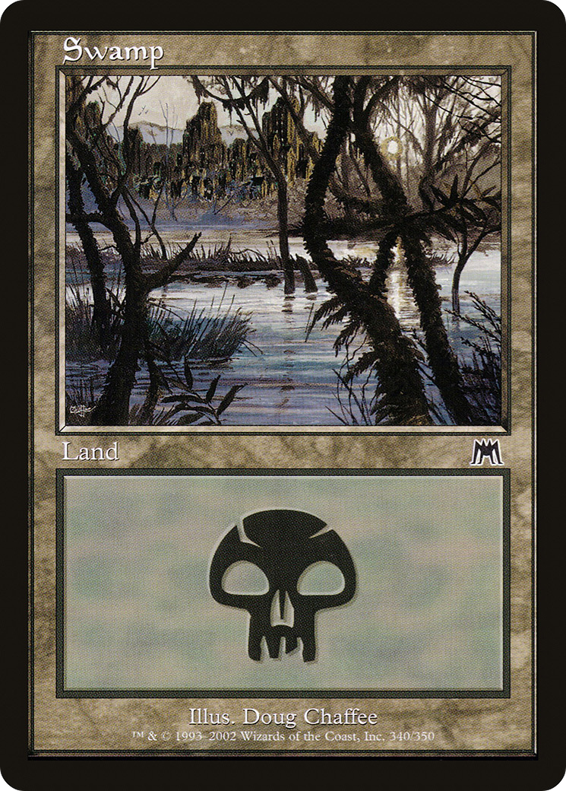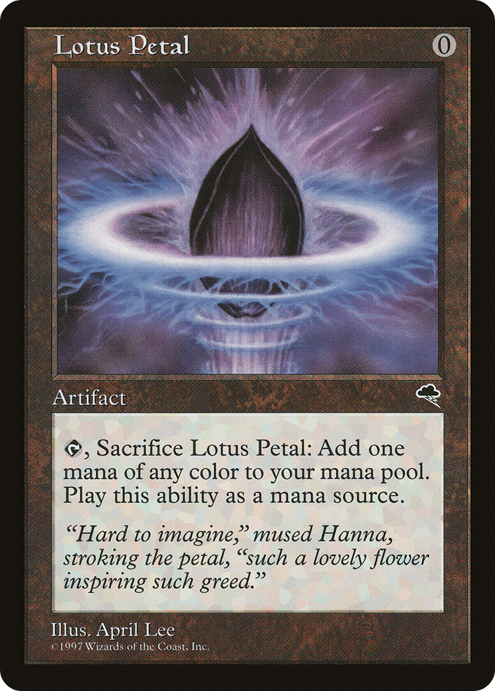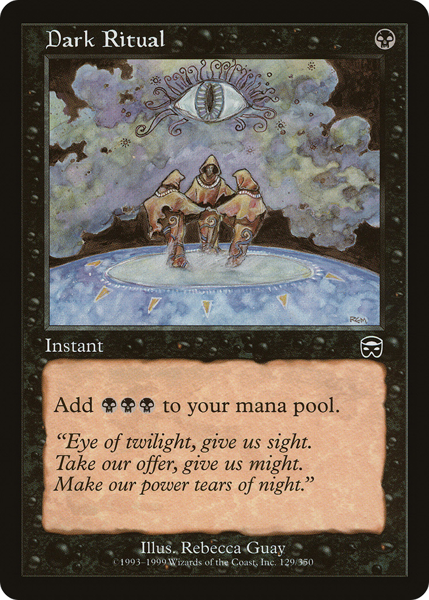

### Reanimation spells:

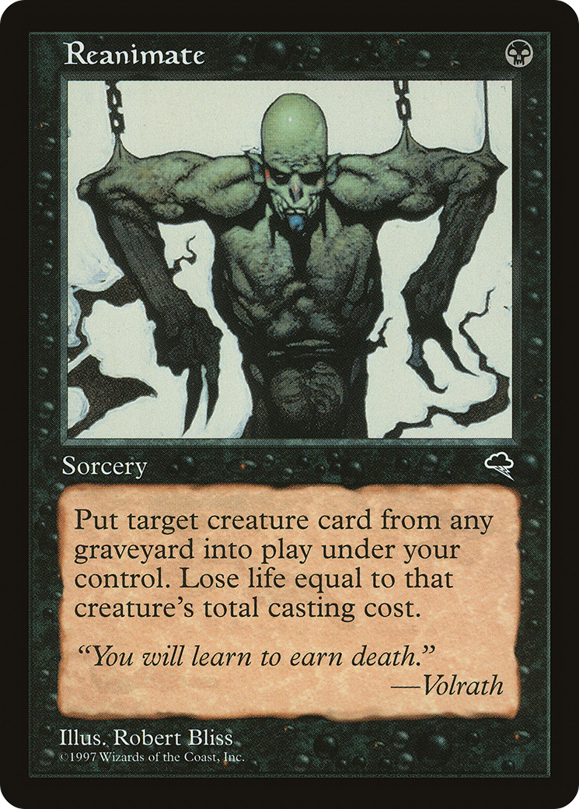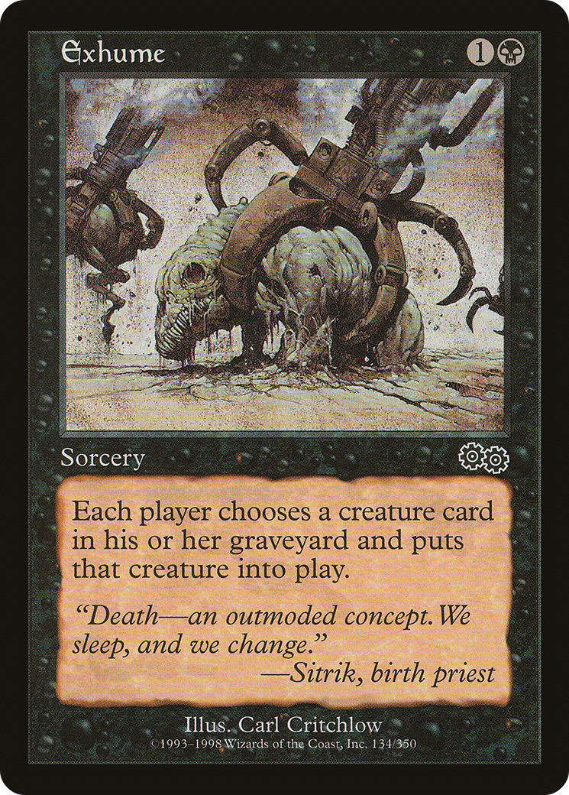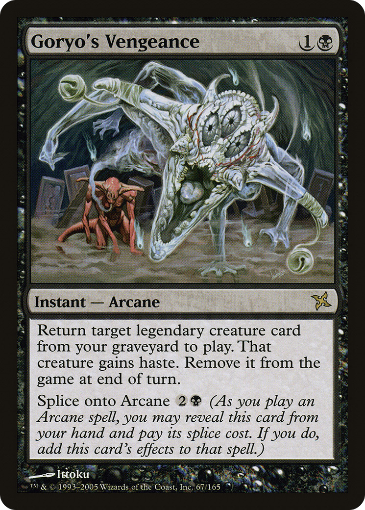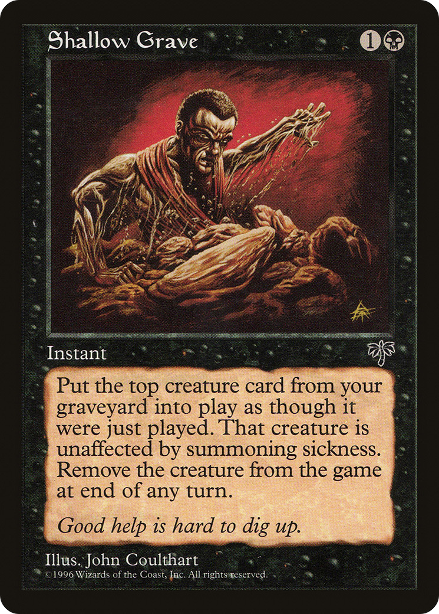

### Utility spells:

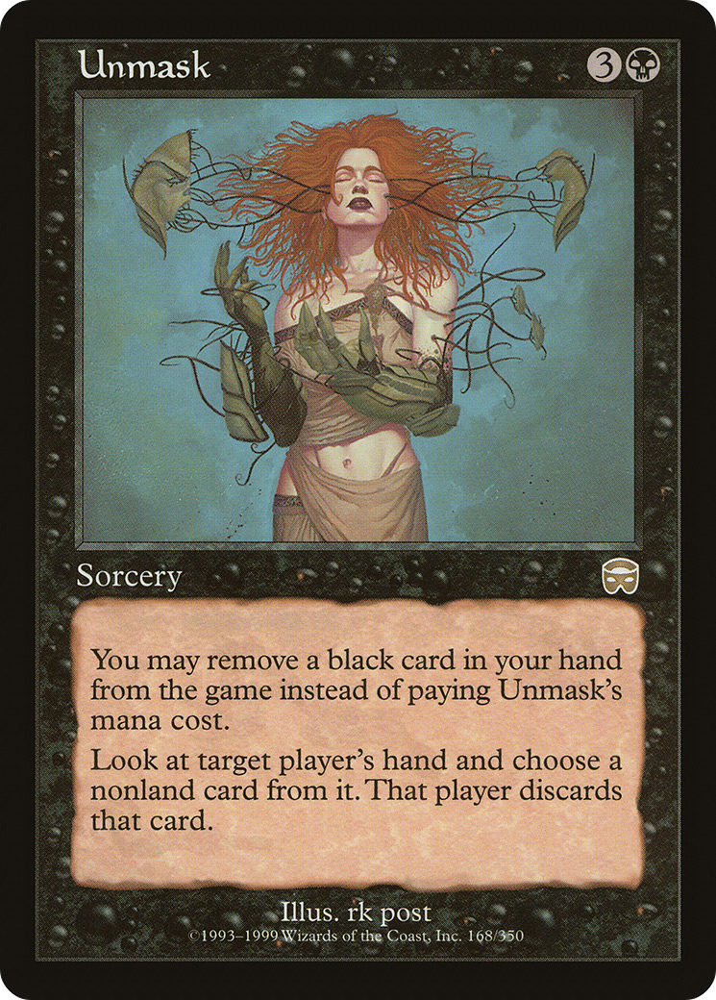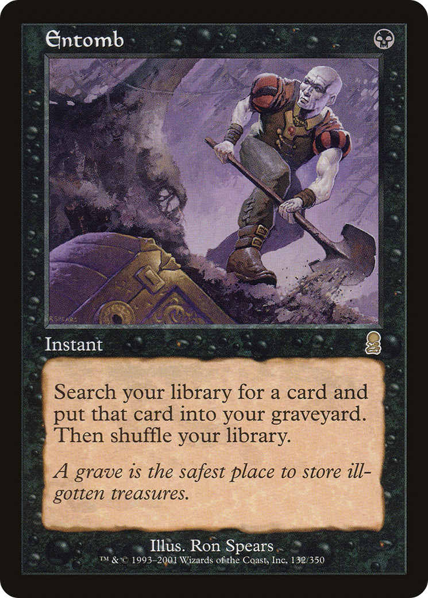

### Creatures:

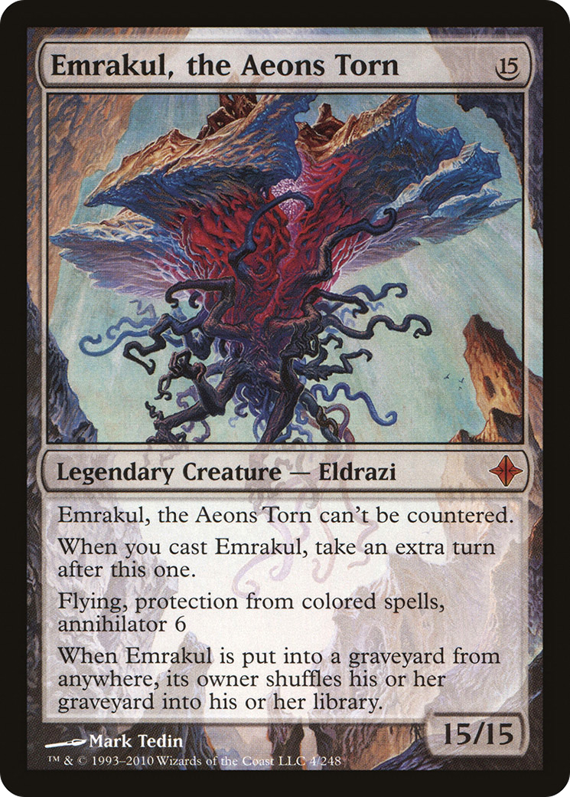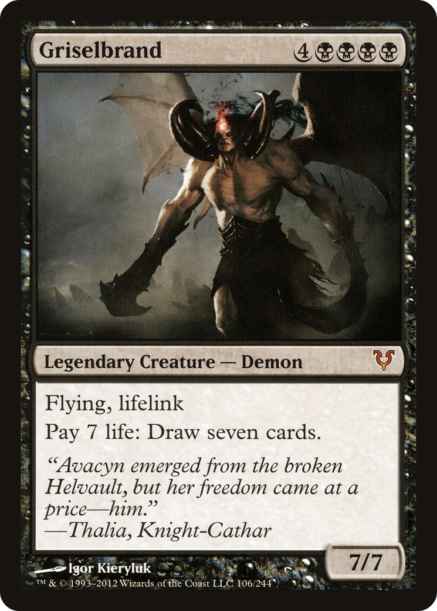
